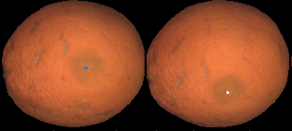

# 3d-rotation-estimation-fruits
Dataset of the paper: Fast 3D rotation estimation of fruits using spheroid models

This repository contains the dataset used in the submitted paper: Fast 3D rotation estimation of fruits using spheroid models. Currenrly under review.

The data folder contains the images of the dataset for 3 types of fruits: mandarins, oranges, tomatoes. 

In each fruit folder there is information about the ground truth used to obtain the paper results.
Basically, it contains the location of points correspondences that are used to estimate the goodness of the 3d rotations. The next figure shows an example of anotation:

If you use this repository, please cite our paper:

@inproceedings{lev-etal-2019-talksumm,
    title = "Fast 3D Rotation Estimation of fruits using spheroid models",
    author = "Albiol, Antonio and Albiol, Alberto and Sanchez, Carlos",
    booktitle = "Submitted for publication",
    month = jan,
    year = "2021",
    publisher = "",
    url = "",
    pages = "",
    abstract = "",
}
